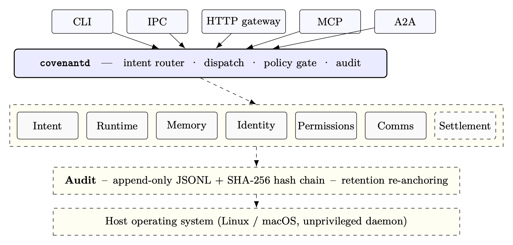

# Covenant

[](https://github.com/open-covenant/covenant/actions/workflows/ci.yml)
[](./LICENSE)
[](https://doi.org/10.5281/zenodo.20134416)
[](./rust-toolchain.toml)

> Open infrastructure for agent-native computing.

<p align="center">
  
</p>

Covenant sits below agent applications and above the host operating system. It owns the state, authority, and accountability concerns that recur across agent frameworks — scoped capabilities, durable memory, runtime isolation, append-only audit, and commit-scoped provenance — so individual frameworks can stop reinventing them.

<!-- METRICS:START -->
**Status.** Local control plane is real and live-tested (27 Rust crates, ~201k lines, 2757 source-discovered Rust tests including 390 live boundary tests). Production-grade sandboxing for hostile agent code, networked multi-peer operation, and daemon-driven on-chain settlement are roadmap. See [BUILT.md](./BUILT.md) for the explicit honesty boundary.
<!-- METRICS:END -->

- **Web:** [opencovenant.org](https://opencovenant.org)
- **Docs:** [docs.opencovenant.org](https://docs.opencovenant.org)
- **Paper:** [DOI: 10.5281/zenodo.20134416](https://doi.org/10.5281/zenodo.20134416)
- **Token:** $CVNT · [`2mNVZ6aEjrGwiUVCfz7XGWpiXuWzgBDoznwE579upump`](https://pump.fun/coin/2mNVZ6aEjrGwiUVCfz7XGWpiXuWzgBDoznwE579upump)

## Quick start

> Try it without installing — **[sandbox.opencovenant.org](https://sandbox.opencovenant.org)**. Public operator console wired to a live daemon, state resets every 12 hours.

To run it locally, build the daemon and CLI, register the sample agent, and start the daemon:

```bash
git clone https://github.com/open-covenant/covenant && cd covenant
cd agent-os && cargo build --workspace --exclude covenant-settlement-program --locked

# Register the example agent (daemon loads $COVENANT_HOME/agents/ at startup)
mkdir -p ~/.covenant/agents
cp -R ../examples/hello-agent ~/.covenant/agents/hello

# Start the daemon
./target/debug/covenantd
```

Then drive it from either surface — they share the same daemon, audit chain, and capability store.

**CLI**

```bash
./target/debug/covenant capabilities grant memory.write
./target/debug/covenant capabilities grant intent.subscribe
./target/debug/covenant intent "say hello"
```

**Operator console** — a Next.js UI for dispatching intents, browsing the audit chain, granting capabilities, and inspecting memory tiers.

```bash
cd agent-os/covenant-web
pnpm install --ignore-workspace
pnpm dev   # http://localhost:3000
```

The console proxies the daemon's HTTP gateway, injects the operator bearer token server-side, and renders every dispatch as a verifiable trace through the hash-chained audit log. See [examples/hello-agent](./examples/hello-agent/) for the agent walkthrough, [docs/demo.md](./docs/demo.md) for a CLI transcript, and [deploy/README.md](./deploy/README.md) for shipping the console as a public sandbox on Render.

## Why Covenant

Software agents are moving from interactive assistance toward long-running engineering work. That shift changes the infrastructure problem. Agents need durable context, explicit authority, reliable tool access, recovery after interruption, and a record of what happened.

Conventional developer environments assume a human operator is present at every step. Blockchain systems assume verifiable state transitions, explicit authority, and durable coordination across independent actors. Covenant brings those assumptions into agent infrastructure:

- **Governance:** intents, manifests, scoped permissions, review gates, and policy-aware dispatch.
- **Continuity:** persistent memory, resumable task state, repair workflows, and structured handoff.
- **Accountability:** append-only audit logs, integrity reports, signed actions, and commit-scoped provenance.
- **Interoperability:** native tools, MCP integration, A2A messaging, local gateway APIs, and protocol adapters.
- **Execution:** daemon-mediated runtime dispatch with budget enforcement and sandbox-aware agent manifests.
- **Settlement:** local receipts and protocol scaffolding for accountable resource use and agent coordination economics.

## Architecture

The system center is `covenantd`, a Rust daemon that owns local state and mediates privileged operations through IPC, an HTTP gateway, signed capabilities, audit logs, memory stores, and runtime dispatch.

| # | Primitive | Role |
|---|---|---|
| 1 | Intent | Normalized request shapes for CLI, IPC, HTTP, routing, and daemon dispatch. |
| 2 | Runtime | Agent execution with budget enforcement (projection-tick preempt and wall-clock backstop at `cpu_ms_per_task`), manifest contracts, trusted-local subprocesses, and opt-in Linux gVisor runner support. |
| 3 | Memory | SQLite-backed working, episodic, and long-term records with embedding hooks, ignore rules, drift reports, repair, and bounded compaction. |
| 4 | Identity | Local ed25519 identity, peer registry, operator tokens, token rotation, and peer revocation. |
| 5 | Permissions | Signed capabilities with known-scope validation, dispatch-time enforcement, expiry, and revocation tombstones. |
| 6 | Comms | IPC frames, local HTTP gateway, MCP adapter, and A2A mailbox primitives. |
| 7 | Compositor | Next.js web console (`agent-os/covenant-web`), public landing/docs surface, and `covenant-tui` terminal UI with intent, memory, audit, capabilities, A2A, chain-receipts, and peer-registry views over the daemon IPC. |
| 8 | Settlement | Local resource receipts and protocol scaffolding for agent coordination economics. |

Audit underlies Identity, Permissions, and Settlement — append-only JSONL events, local hash-chain integrity reports, retention controls, signed actions, and audit-root attestations. The primary implementation lives in `agent-os/`, the Rust workspace containing the daemon, CLI, TUI, protocol crates, runtime, memory, identity, permissions, peer authentication, audit, MCP and A2A adapters, budget ledger, and settlement components. The surrounding monorepo contains public documentation, web surfaces, circuits, SDK packages, and supporting services.

See [docs/audit-integrity.md](./docs/audit-integrity.md), [docs/capabilities.md](./docs/capabilities.md), and [agent-os/README.md](./agent-os/README.md) for implementation details and validation evidence.

## Capabilities

Covenant includes:

- Rust daemon and CLI for local agent orchestration.
- IPC and local HTTP gateway surfaces.
- Signed capability lifecycle for implemented namespaces, including grant-time validation, expiry, revocation, and dispatch-time scope enforcement.
- Peer authentication, operator token rotation, peer revocation, and peer-scoped A2A checks.
- Append-only audit log with structured event types, bounded reads, retention purge, and local hash-chain verification.
- SQLite-backed project memory across working, episodic, and long-term tiers.
- MCP adapter, native tool integration, and A2A mailbox primitives.
- Budget ledger primitives with daemon-backed pause checkpoint storage for budget exhaustion, shutdown drains, and single-use resume handoff.
- Local settlement receipts for resource accounting.
- Commit-scoped provenance envelopes that bind task records, changed Git blobs, transition events, and validation evidence.
- Unsigned or locally signed audit-root attestations for local integrity reports, with release-target binding to release-subject and release-scope manifests so a single attestation covers the audit log, the release artifact set, and the in-scope task set.
- Opt-in live tests for daemon, CLI, runtime, and selected backend boundaries.
- Source-built local installer for the daemon and CLI with a relative-path install manifest.
- CI coverage for Rust, documentation, workflow linting, provenance verification, dependency audits, and CodeQL. Public live-test inventory comes from source; private workflow checkouts may add stricter matrix validation.

## Validation

Run the scripts-only gate when the change does not need Rust tooling:

```bash
bash agent-os/scripts/validate.sh --scripts
```

Run the fast local gate from the repository root:

```bash
bash agent-os/scripts/validate.sh --quick
```

Run the full Rust validation gate:

```bash
bash agent-os/scripts/validate.sh
```

Verify committed provenance envelopes:

```bash
node agent-os/scripts/provenance.mjs verify-all
```

Build the public documentation surface:

```bash
pnpm --dir landing install --frozen-lockfile --ignore-workspace
pnpm --dir landing build
```

Run live boundary tests when host prerequisites are available:

```bash
cd agent-os
cargo test --workspace --exclude covenant-settlement-program -- --ignored live_
```

Inspect the public live coverage inventory:

```bash
bash agent-os/scripts/test-stats.sh
```

## Research Direction

Covenant advances open infrastructure for:

- governed autonomous software maintenance;
- verifiable agent actions and commit-scoped provenance;
- capability-scoped delegation across local and remote agents;
- durable project memory for long-running work;
- resumable task ownership across interruptions;
- policy-aware tool use and sandboxed execution;
- audit-root attestations, public provenance, and agent coordination economics.

## Citing

If you use Covenant in academic work or reference the design in a paper, please cite the whitepaper:

> Covenant contributors. (2026). *Covenant: A Capability-Based Operating Layer for Autonomous Software Engineering Agents*. Zenodo. https://doi.org/10.5281/zenodo.20134416

```bibtex
@misc{covenant2026,
  author    = {Covenant contributors},
  title     = {Covenant: A Capability-Based Operating Layer for Autonomous Software Engineering Agents},
  year      = {2026},
  publisher = {Zenodo},
  doi       = {10.5281/zenodo.20134416},
  url       = {https://doi.org/10.5281/zenodo.20134416}
}
```

A copy of the PDF lives at [opencovenant.org/paper.pdf](https://opencovenant.org/paper.pdf); the LaTeX source is under [`paper/arxiv/`](./paper/arxiv/).

## Contributing

Covenant is systems infrastructure with security-sensitive boundaries. Contributions should include a validation plan, tests for changed behavior, and a clear statement of operational impact.

Start with [CONTRIBUTING.md](./CONTRIBUTING.md) and [ROADMAP.md](./ROADMAP.md). Changes touching identity, permissions, audit, runtime isolation, settlement, provenance, release automation, or CI should receive especially close review.

## Security

Follow [SECURITY.md](./SECURITY.md) for responsible disclosure. The runtime isolation boundary is tracked in [docs/runtime-sandbox-security.md](./docs/runtime-sandbox-security.md). Do not open public issues for vulnerabilities.

## License

Apache-2.0. See [LICENSE](./LICENSE).
